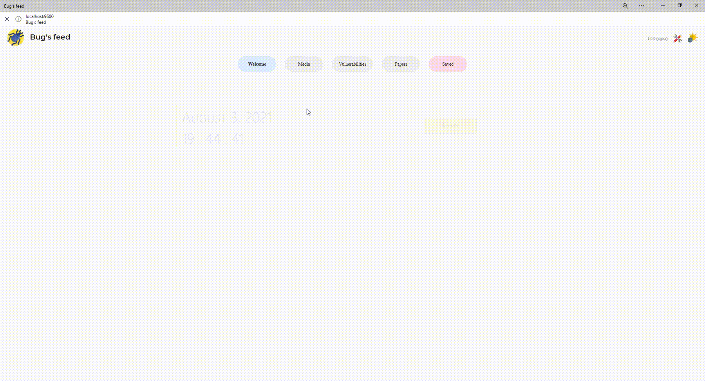

<p align="center">
  <a href="https://github.com/pwnedshell/Bugs-feed/network/members">
    
  </a>
  <a href="https://github.com/pwnedshell/Bugs-feed/stargazers">
    
  </a>
  <a href="https://github.com/pwnedshell/Bugs-feed/issues">
    
  </a>
  <a href="https://github.com/pwnedshell/Bugs-feed/blob/master/LICENSE.txt">
    
  </a>
  <a href="https://linkedin.com/in/alejandro-cruz-martínez">
    
  </a>
</p>

<br>
<p align="center">
  <a href="https://github.com/pwnedshell/Bugs-feed">
    
  </a>

  <h1 align="center">Bug's feed</h1>

  <p align="center">
    Bug's feed is a local hosted portal where you can search for the latest news, videos, CVEs, vulnerabilities...
    It's implemented as a PWA application so you can get rid of the explorer and use it as a desktop application.
    Navigate through different tabs and take a look to the latest bugs or search in all of them at once.
    It comes with a configuration pane in which you can modify hashtags and video channels to your own belong. 
  </p>
</p>

<br>

## 🐝 About The Project

> ⚠️ This is my first huge project. It's not perfect and will need to be improved. See Contributing.

<p align="justify">
  As a hacking and development enthusiast I'm in love with the idea of making my own scripts of the lastest vulnerabilities. <br>
  <strong>The problem: </strong>there is so much information out there. Lots of new vulnerabilities are discovered in just a day, innumerable related tweets are  written and so their corresponding videos are filmed. <br>
  <strong>The solution: </strong>to gather all the information in one place and make it easy to disaggregate so you can extract the relevant knowledge.
</p>
<p align="justify">
Bug's feed is a docker containered <a href="https://pypi.org/project/Flask/">Flask</a> application which makes use of <a href="https://www.selenium.dev/">Selenium</a>, <a href="https://github.com/twintproject/twint">Twint</a> and <a href="https://pypi.org/project/feedparser/">FeedParser</a> to scrape different websites like Hackerone, Youtube, Bugcrowd, Exploit Database or Twitter and stores the results in a <a href="https://www.mongodb.com/es">Mongo</a> database. <br>
Most of requests go through <a href="https://www.torproject.org/">Tor</a> and with a random user agent.
</p>

> Except those to twitter, youtube and bugcrowd (this may change in the future).

<p align="center">
    
</p>

> ⚠️ Scrapping so much information, depending on different websites, makes easy to break some of the scripts. Consider using the manual refresh button if something fails.


## 🦟 Prerequisites

<ul>
  <li><a href="https://www.docker.com/">Docker</a></li>
  <li><a href="https://docs.docker.com/compose/">Docker-compose</a></li>
</ul>

## 🦗 Installation

>🥢 You can define the port on the .env file

#### 📦 Release

Download the [latest release](https://github.com/PwnedShell/Bugs-feed/releases/latest) and run `docker-compose up -d`

#### 🌱 Source code

```bash
# Clone Bugs-feed
git clone https://github.com/pwnedshell/Bugs-feed.git

# Go to Bugs-feed folder
cd Bugs-feed/

# Run docker compose
docker-compose up -d
```

## 🦋 Usage

1. Go to [localhost:9600](http://localhost:9600) 
2. Wait 5 minutes (only first time)
3. Download the desktop application (optional)
4. Hunting time!

## 🐜 Contributing

<p align="justify">
I have developed this project by myself. I carry other projects and I'm not able to focus on this one. Please feel free to contribute. I would try to fix bugs and implement more features as fast as possible.
</p>

1. Fork the Project
2. Create your Feature Branch (`git checkout -b feature/AmazingFeature`)
3. Commit your Changes (`git commit -m 'Add some AmazingFeature'`)
4. Push to the Branch (`git push origin feature/AmazingFeature`)
5. Open a <a href="https://github.com/PwnedShell/Bugs-feed/pulls">Pull Request</a>

## 🐍 Disclaimer

<p align="justify">
This project is designed to facilitate information about recent vulnerabilities, always referring to its scrapped pages. The use of the obtained information it's under your own responsibility.
</p>

## 🐛 License

Distributed under the GNU General Public License v3.0. See `LICENSE` for more information.

## 🐌 Acknowledgements

<table>
  <tr>
    <td align="center">
      <a href="https://github.com/esquilichi">
      <br/>
      <sub><b>Ismael Esquilichi</b></sub></a><br/>
      <span title="Tests">👷🏻</span> <span title="Ideas, Planning, & Feedback">🤔</span>
    </td>
    <td align="center">
      <a href="https://github.com/rmartinsanta">
      <br/>
      <sub><b>Raúl Martín</b></sub></a><br/>
      <span title="Mentoring">🎒</span>
    </td>
    <td align="center">
      <a href="https://github.com/AndreaOliva99">
      <br/>
      <sub><b>ThirstyBytes</b></sub></a><br/>
      <span title="Translation">🌎</span>
    </td>
  </tr>
</table>